# Prolog Execution Trace: gcd(10, 16, X)

## Query

```
gcd(10, 16, X)
```

## Clause Definitions

| Line # | Clause |
|--------|--------|
| 6 | `gcd(X, X, X)` |
| 9 | `gcd(X, Y, D) :- X < Y, Y1 is Y - X, gcd(X, Y1, D)` |
| 15 | `gcd(X, Y, D) :- Y < X, gcd(Y, X, D)` |
| 22 | `llength([], 0)` |
| 23 | `llength([_|T], N) :- llength(T, N1), N is N1 + 1` |

## Execution Timeline

<pre style="line-height: 1.15">
┌─ Step 1: gcd(10, 16, X)
│  Clause: gcd(X@1, Y@1, D@1) [line 9]
│  Unifications:
│    X@1 = 10
│    Y@1 = 16
│  Subgoals:
│    [1.1] X@1 &lt; Y@1 → 10 &lt; 16
│    [1.2] Y1@1 is Y@1 - X@1 → Y1@1 is 16 - 10
│    [1.3] gcd(X@1, Y1@1, D@1) → gcd(10, Y1@1, D@1)
│  
│  ┌─ Step 2 [Goal 1.1]: X@1 &lt; Y@1 → 10 &lt; 16
│  └─
│  ┌─ Step 3 [Goal 1.2]: Y1@1 is Y@1 - X@1 → Y1@1 is 16 - 10
│  │  =&gt; Y1@1 = 6
│  └─
│  ┌─ Step 4 [Goal 1.3]: gcd(X@1, Y1@1, D@1) → gcd(10, Y1@1, D@1)
│  │  Clause: gcd(X@4, Y@4, D@4) [line 15]
│  │  Unifications:
│  │    X@4 = 10
│  │    Y@4 = 6
│  │  Subgoals:
│  │    [4.1] Y@4 &lt; X@4 → 6 &lt; 10
│  │    [4.2] gcd(Y@4, X@4, D@4) → gcd(6, 10, D@4)
│  │  
│  │  ┌─ Step 5 [Goal 4.1]: Y@4 &lt; X@4 → 6 &lt; 10
│  │  └─
│  │  ┌─ Step 6 [Goal 4.2]: gcd(Y@4, X@4, D@4) → gcd(6, 10, D@4)
│  │  │  Clause: gcd(X@6, Y@6, D@6) [line 9]
│  │  │  Unifications:
│  │  │    X@6 = 6
│  │  │    Y@6 = 10
│  │  │  Subgoals:
│  │  │    [6.1] X@6 &lt; Y@6 → 6 &lt; 10
│  │  │    [6.2] Y1@6 is Y@6 - X@6 → Y1@6 is 10 - 6
│  │  │    [6.3] gcd(X@6, Y1@6, D@6) → gcd(6, Y1@6, D@6)
│  │  │  
│  │  │  ┌─ Step 7 [Goal 6.1]: X@6 &lt; Y@6 → 6 &lt; 10
│  │  │  └─
│  │  │  ┌─ Step 8 [Goal 6.2]: Y1@6 is Y@6 - X@6 → Y1@6 is 10 - 6
│  │  │  │  =&gt; Y1@6 = 4
│  │  │  └─
│  │  │  ┌─ Step 9 [Goal 6.3]: gcd(X@6, Y1@6, D@6) → gcd(6, Y1@6, D@6)
│  │  │  │  Clause: gcd(X@9, Y@9, D@9) [line 15]
│  │  │  │  Unifications:
│  │  │  │    X@9 = 6
│  │  │  │    Y@9 = 4
│  │  │  │  Subgoals:
│  │  │  │    [9.1] Y@9 &lt; X@9 → 4 &lt; 6
│  │  │  │    [9.2] gcd(Y@9, X@9, D@9) → gcd(4, 6, D@9)
│  │  │  │  
│  │  │  │  ┌─ Step 10 [Goal 9.1]: Y@9 &lt; X@9 → 4 &lt; 6
│  │  │  │  └─
│  │  │  │  ┌─ Step 11 [Goal 9.2]: gcd(Y@9, X@9, D@9) → gcd(4, 6, D@9)
│  │  │  │  │  Clause: gcd(X@11, Y@11, D@11) [line 9]
│  │  │  │  │  Unifications:
│  │  │  │  │    X@11 = 4
│  │  │  │  │    Y@11 = 6
│  │  │  │  │  Subgoals:
│  │  │  │  │    [11.1] X@11 &lt; Y@11 → 4 &lt; 6
│  │  │  │  │    [11.2] Y1@11 is Y@11 - X@11 → Y1@11 is 6 - 4
│  │  │  │  │    [11.3] gcd(X@11, Y1@11, D@11) → gcd(4, Y1@11, D@11)
│  │  │  │  │  
│  │  │  │  │  ┌─ Step 12 [Goal 11.1]: X@11 &lt; Y@11 → 4 &lt; 6
│  │  │  │  │  └─
│  │  │  │  │  ┌─ Step 13 [Goal 11.2]: Y1@11 is Y@11 - X@11 → Y1@11 is 6 - 4
│  │  │  │  │  │  =&gt; Y1@11 = 2
│  │  │  │  │  └─
│  │  │  │  │  ┌─ Step 14 [Goal 11.3]: gcd(X@11, Y1@11, D@11) → gcd(4, Y1@11, D@11)
│  │  │  │  │  │  Clause: gcd(X@14, Y@14, D@14) [line 15]
│  │  │  │  │  │  Unifications:
│  │  │  │  │  │    X@14 = 4
│  │  │  │  │  │    Y@14 = 2
│  │  │  │  │  │  Subgoals:
│  │  │  │  │  │    [14.1] Y@14 &lt; X@14 → 2 &lt; 4
│  │  │  │  │  │    [14.2] gcd(Y@14, X@14, D@14) → gcd(2, 4, D@14)
│  │  │  │  │  │  
│  │  │  │  │  │  ┌─ Step 15 [Goal 14.1]: Y@14 &lt; X@14 → 2 &lt; 4
│  │  │  │  │  │  └─
│  │  │  │  │  │  ┌─ Step 16 [Goal 14.2]: gcd(Y@14, X@14, D@14) → gcd(2, 4, D@14)
│  │  │  │  │  │  │  Clause: gcd(X@16, Y@16, D@16) [line 9]
│  │  │  │  │  │  │  Unifications:
│  │  │  │  │  │  │    X@16 = 2
│  │  │  │  │  │  │    Y@16 = 4
│  │  │  │  │  │  │  Subgoals:
│  │  │  │  │  │  │    [16.1] X@16 &lt; Y@16 → 2 &lt; 4
│  │  │  │  │  │  │    [16.2] Y1@16 is Y@16 - X@16 → Y1@16 is 4 - 2
│  │  │  │  │  │  │    [16.3] gcd(X@16, Y1@16, D@16) → gcd(2, Y1@16, D@16)
│  │  │  │  │  │  │  
│  │  │  │  │  │  │  ┌─ Step 17 [Goal 16.1]: X@16 &lt; Y@16 → 2 &lt; 4
│  │  │  │  │  │  │  └─
│  │  │  │  │  │  │  ┌─ Step 18 [Goal 16.2]: Y1@16 is Y@16 - X@16 → Y1@16 is 4 - 2
│  │  │  │  │  │  │  │  =&gt; Y1@16 = 2
│  │  │  │  │  │  │  └─
│  │  │  │  │  │  │  ┌─ Step 19 [Goal 16.3]: gcd(X@16, Y1@16, D@16) → gcd(2, Y1@16, D@16)
│  │  │  │  │  │  │  │  Fact: gcd(X@19, X@19, X@19) [line 6]
│  │  │  │  │  │  │  │  Unifications:
│  │  │  │  │  │  │  │    X@19 = 2
│  │  │  │  │  │  │  │    X@19 = 2
│  │  │  │  │  │  │  │  =&gt; D@16 = 2
│  │  │  │  │  │  │  └─
│  │  │  │  │  │  │  =&gt; D@14 = 2
│  │  │  │  │  │  └─
│  │  │  │  │  │  =&gt; D@11 = 2
│  │  │  │  │  └─
│  │  │  │  │  =&gt; D@9 = 2
│  │  │  │  └─
│  │  │  │  =&gt; D@6 = 2
│  │  │  └─
│  │  │  =&gt; D@4 = 2
│  │  └─
│  │  =&gt; D@1 = 2
│  └─
│  =&gt; X = 2
└─

</pre>

## Call Tree

```mermaid
%%{init: {'flowchart': {'nodeSpacing': 46, 'rankSpacing': 50}, 'themeVariables': {'fontSize': '15px'}}}%%
graph TD

%% Nodes
A["?- gcd(10, 16, X)"]
B["① gcd(10, 16, X)<br/>X = 2 · clause 9"]
C["② X@1 &lt; Y@1"]
D["③ Y1@1 is Y@1 - X@1"]
E["④ gcd(X@1, Y1@1, D@1)<br/>D@1 = 2 · clause 15"]
F["⑤ Y@4 &lt; X@4"]
G["⑥ gcd(Y@4, X@4, D@4)<br/>D@4 = 2 · clause 9"]
H["⑦ X@6 &lt; Y@6"]
I["⑧ Y1@6 is Y@6 - X@6"]
J["⑨ gcd(X@6, Y1@6, D@6)<br/>D@6 = 2 · clause 15"]
K["⑩ Y@9 &lt; X@9"]
L["⑪ gcd(Y@9, X@9, D@9)<br/>D@9 = 2 · clause 9"]
M["⑫ X@11 &lt; Y@11"]
N["⑬ Y1@11 is Y@11 - X@11"]
O["⑭ gcd(X@11, Y1@11, D@11)<br/>D@11 = 2 · clause 15"]
P["⑮ Y@14 &lt; X@14"]
Q["⑯ gcd(Y@14, X@14, D@14)<br/>D@14 = 2 · clause 9"]
R["⑰ X@16 &lt; Y@16"]
S["⑱ Y1@16 is Y@16 - X@16"]
T["⑲ gcd(X@16, Y1@16, D@16)<br/>D@16 = 2 · fact 6"]
U["✓ X = 2"]

%% Flow
A --> B
B --> C
C --> D
D --> E
E --> F
F --> G
G --> H
H --> I
I --> J
J --> K
K --> L
L --> M
M --> N
N --> O
O --> P
P --> Q
Q --> R
R --> S
S --> T
B --> U

%% Styles
style A fill:#e1f5ff,stroke:#01579b,stroke-width:3px,color:#0b2440
style B fill:#c8e6c9,stroke:#388e3c,color:#14361a
style C fill:#c8e6c9,stroke:#388e3c,color:#14361a
style D fill:#c8e6c9,stroke:#388e3c,color:#14361a
style E fill:#c8e6c9,stroke:#388e3c,color:#14361a
style F fill:#c8e6c9,stroke:#388e3c,color:#14361a
style G fill:#c8e6c9,stroke:#388e3c,color:#14361a
style H fill:#c8e6c9,stroke:#388e3c,color:#14361a
style I fill:#c8e6c9,stroke:#388e3c,color:#14361a
style J fill:#c8e6c9,stroke:#388e3c,color:#14361a
style K fill:#c8e6c9,stroke:#388e3c,color:#14361a
style L fill:#c8e6c9,stroke:#388e3c,color:#14361a
style M fill:#c8e6c9,stroke:#388e3c,color:#14361a
style N fill:#c8e6c9,stroke:#388e3c,color:#14361a
style O fill:#c8e6c9,stroke:#388e3c,color:#14361a
style P fill:#c8e6c9,stroke:#388e3c,color:#14361a
style Q fill:#c8e6c9,stroke:#388e3c,color:#14361a
style R fill:#c8e6c9,stroke:#388e3c,color:#14361a
style S fill:#c8e6c9,stroke:#388e3c,color:#14361a
style T fill:#c8e6c9,stroke:#388e3c,color:#14361a
style U fill:#c8e6c9,stroke:#2e7d32,stroke-width:3px,color:#14361a
```



## Final Answer

```
X = 2
```

_Showing the first solution only — re-run with `-n <count>` or `--all` to see more._