# Prolog Execution Trace: gcd(10, 16, X)

## Query

```
gcd(10, 16, X)
```

## Clause Definitions

| Line # | Clause |
|--------|--------|
| 6 | `gcd(X, X, X)` |
| 9 | `gcd(X, Y, D) :- X < Y, Y1 is Y - X, gcd(X, Y1, D)` |
| 15 | `gcd(X, Y, D) :- Y < X, gcd(Y, X, D)` |
| 22 | `llength([], 0)` |
| 23 | `llength([_|T], N) :- llength(T, N1), N is N1 + 1` |

## Execution Timeline

<pre style="line-height: 1.15">
┌─ Step 1: gcd(10, 16, X)
│  Clause: gcd(X, Y, D) [line 9]
│  Unifications:
│    X = 10
│    Y = 16
│  Subgoals:
│    [1.1] X &lt; Y → 10 &lt; 16
│    [1.2] Y1 is Y - X → Y1 is 16 - 10
│    [1.3] gcd(X, Y1, D) → gcd(10, Y1, D)
│  
│  ┌─ Step 2 [Goal 1.1]: X &lt; Y → 10 &lt; 16
│  └─
│  ┌─ Step 3 [Goal 1.2]: Y1 is Y - X → Y1 is 16 - 10
│  │  =&gt; Y1 = 6
│  └─
│  ┌─ Step 4 [Goal 1.3]: gcd(X, Y1, D) → gcd(10, Y1, D)
│  │  Clause: gcd(X, Y, D) [line 15]
│  │  Unifications:
│  │    X = 10
│  │    Y = 6
│  │  Subgoals:
│  │    [4.1] Y &lt; X → 6 &lt; 10
│  │    [4.2] gcd(Y, X, D) → gcd(6, 10, D)
│  │  
│  │  ┌─ Step 5 [Goal 4.1]: Y &lt; X → 6 &lt; 10
│  │  └─
│  │  ┌─ Step 6 [Goal 4.2]: gcd(Y, X, D) → gcd(6, 10, D)
│  │  │  Clause: gcd(X, Y, D) [line 9]
│  │  │  Unifications:
│  │  │    X = 6
│  │  │    Y = 10
│  │  │  Subgoals:
│  │  │    [6.1] X &lt; Y → 6 &lt; 10
│  │  │    [6.2] Y1 is Y - X → Y1 is 10 - 6
│  │  │    [6.3] gcd(X, Y1, D) → gcd(6, Y1, D)
│  │  │  
│  │  │  ┌─ Step 7 [Goal 6.1]: X &lt; Y → 6 &lt; 10
│  │  │  └─
│  │  │  ┌─ Step 8 [Goal 6.2]: Y1 is Y - X → Y1 is 10 - 6
│  │  │  │  =&gt; Y1 = 4
│  │  │  └─
│  │  │  ┌─ Step 9 [Goal 6.3]: gcd(X, Y1, D) → gcd(6, Y1, D)
│  │  │  │  Clause: gcd(X, Y, D) [line 15]
│  │  │  │  Unifications:
│  │  │  │    X = 6
│  │  │  │    Y = 4
│  │  │  │  Subgoals:
│  │  │  │    [9.1] Y &lt; X → 4 &lt; 6
│  │  │  │    [9.2] gcd(Y, X, D) → gcd(4, 6, D)
│  │  │  │  
│  │  │  │  ┌─ Step 10 [Goal 9.1]: Y &lt; X → 4 &lt; 6
│  │  │  │  └─
│  │  │  │  ┌─ Step 11 [Goal 9.2]: gcd(Y, X, D) → gcd(4, 6, D)
│  │  │  │  │  Clause: gcd(X, Y, D) [line 9]
│  │  │  │  │  Unifications:
│  │  │  │  │    X = 4
│  │  │  │  │    Y = 6
│  │  │  │  │  Subgoals:
│  │  │  │  │    [11.1] X &lt; Y → 4 &lt; 6
│  │  │  │  │    [11.2] Y1 is Y - X → Y1 is 6 - 4
│  │  │  │  │    [11.3] gcd(X, Y1, D) → gcd(4, Y1, D)
│  │  │  │  │  
│  │  │  │  │  ┌─ Step 12 [Goal 11.1]: X &lt; Y → 4 &lt; 6
│  │  │  │  │  └─
│  │  │  │  │  ┌─ Step 13 [Goal 11.2]: Y1 is Y - X → Y1 is 6 - 4
│  │  │  │  │  │  =&gt; Y1 = 2
│  │  │  │  │  └─
│  │  │  │  │  ┌─ Step 14 [Goal 11.3]: gcd(X, Y1, D) → gcd(4, Y1, D)
│  │  │  │  │  │  Clause: gcd(X, Y, D) [line 15]
│  │  │  │  │  │  Unifications:
│  │  │  │  │  │    X = 4
│  │  │  │  │  │    Y = 2
│  │  │  │  │  │  Subgoals:
│  │  │  │  │  │    [14.1] Y &lt; X → 2 &lt; 4
│  │  │  │  │  │    [14.2] gcd(Y, X, D) → gcd(2, 4, D)
│  │  │  │  │  │  
│  │  │  │  │  │  ┌─ Step 15 [Goal 14.1]: Y &lt; X → 2 &lt; 4
│  │  │  │  │  │  └─
│  │  │  │  │  │  ┌─ Step 16 [Goal 14.2]: gcd(Y, X, D) → gcd(2, 4, D)
│  │  │  │  │  │  │  Clause: gcd(X, Y, D) [line 9]
│  │  │  │  │  │  │  Unifications:
│  │  │  │  │  │  │    X = 2
│  │  │  │  │  │  │    Y = 4
│  │  │  │  │  │  │  Subgoals:
│  │  │  │  │  │  │    [16.1] X &lt; Y → 2 &lt; 4
│  │  │  │  │  │  │    [16.2] Y1 is Y - X → Y1 is 4 - 2
│  │  │  │  │  │  │    [16.3] gcd(X, Y1, D) → gcd(2, Y1, D)
│  │  │  │  │  │  │  
│  │  │  │  │  │  │  ┌─ Step 17 [Goal 16.1]: X &lt; Y → 2 &lt; 4
│  │  │  │  │  │  │  └─
│  │  │  │  │  │  │  ┌─ Step 18 [Goal 16.2]: Y1 is Y - X → Y1 is 4 - 2
│  │  │  │  │  │  │  │  =&gt; Y1 = 2
│  │  │  │  │  │  │  └─
│  │  │  │  │  │  │  ┌─ Step 19 [Goal 16.3]: gcd(X, Y1, D) → gcd(2, Y1, D)
│  │  │  │  │  │  │  │  Fact: gcd(X, X, X) [line 6]
│  │  │  │  │  │  │  │  Unifications:
│  │  │  │  │  │  │  │    X = 2
│  │  │  │  │  │  │  │    X = 2
│  │  │  │  │  │  │  │  =&gt; D = 2
│  │  │  │  │  │  │  └─
│  │  │  │  │  │  │  =&gt; D = 2
│  │  │  │  │  │  └─
│  │  │  │  │  │  =&gt; D = 2
│  │  │  │  │  └─
│  │  │  │  │  =&gt; D = 2
│  │  │  │  └─
│  │  │  │  =&gt; D = 2
│  │  │  └─
│  │  │  =&gt; D = 2
│  │  └─
│  │  =&gt; D = 2
│  └─
│  =&gt; X = 2
└─

</pre>

## Call Tree

```mermaid
%%{init: {'flowchart': {'nodeSpacing': 46, 'rankSpacing': 50}, 'themeVariables': {'fontSize': '15px'}}}%%
graph TD

%% Nodes
A["?- gcd(10, 16, X)"]
B["① gcd(10, 16, X)<br/>X = 2 · clause 9"]
C["② X &lt; Y"]
D["③ Y1 is Y - X"]
E["④ gcd(X, Y1, D)<br/>D = 2 · clause 15"]
F["⑤ Y &lt; X"]
G["⑥ gcd(Y, X, D)<br/>D = 2 · clause 9"]
H["⑦ X &lt; Y"]
I["⑧ Y1 is Y - X"]
J["⑨ gcd(X, Y1, D)<br/>D = 2 · clause 15"]
K["⑩ Y &lt; X"]
L["⑪ gcd(Y, X, D)<br/>D = 2 · clause 9"]
M["⑫ X &lt; Y"]
N["⑬ Y1 is Y - X"]
O["⑭ gcd(X, Y1, D)<br/>D = 2 · clause 15"]
P["⑮ Y &lt; X"]
Q["⑯ gcd(Y, X, D)<br/>D = 2 · clause 9"]
R["⑰ X &lt; Y"]
S["⑱ Y1 is Y - X"]
T["⑲ gcd(X, Y1, D)<br/>D = 2 · fact 6"]
U["✓ X = 2"]

%% Flow
A --> B
B --> C
C --> D
D --> E
E --> F
F --> G
G --> H
H --> I
I --> J
J --> K
K --> L
L --> M
M --> N
N --> O
O --> P
P --> Q
Q --> R
R --> S
S --> T
B --> U

%% Styles
style A fill:#e1f5ff,stroke:#01579b,stroke-width:3px,color:#0b2440
style B fill:#c8e6c9,stroke:#388e3c,color:#14361a
style C fill:#c8e6c9,stroke:#388e3c,color:#14361a
style D fill:#c8e6c9,stroke:#388e3c,color:#14361a
style E fill:#c8e6c9,stroke:#388e3c,color:#14361a
style F fill:#c8e6c9,stroke:#388e3c,color:#14361a
style G fill:#c8e6c9,stroke:#388e3c,color:#14361a
style H fill:#c8e6c9,stroke:#388e3c,color:#14361a
style I fill:#c8e6c9,stroke:#388e3c,color:#14361a
style J fill:#c8e6c9,stroke:#388e3c,color:#14361a
style K fill:#c8e6c9,stroke:#388e3c,color:#14361a
style L fill:#c8e6c9,stroke:#388e3c,color:#14361a
style M fill:#c8e6c9,stroke:#388e3c,color:#14361a
style N fill:#c8e6c9,stroke:#388e3c,color:#14361a
style O fill:#c8e6c9,stroke:#388e3c,color:#14361a
style P fill:#c8e6c9,stroke:#388e3c,color:#14361a
style Q fill:#c8e6c9,stroke:#388e3c,color:#14361a
style R fill:#c8e6c9,stroke:#388e3c,color:#14361a
style S fill:#c8e6c9,stroke:#388e3c,color:#14361a
style T fill:#c8e6c9,stroke:#388e3c,color:#14361a
style U fill:#c8e6c9,stroke:#2e7d32,stroke-width:3px,color:#14361a
```



## Final Answer

```
X = 2
```

_Showing the first solution only — re-run with `-n <count>` or `--all` to see more._