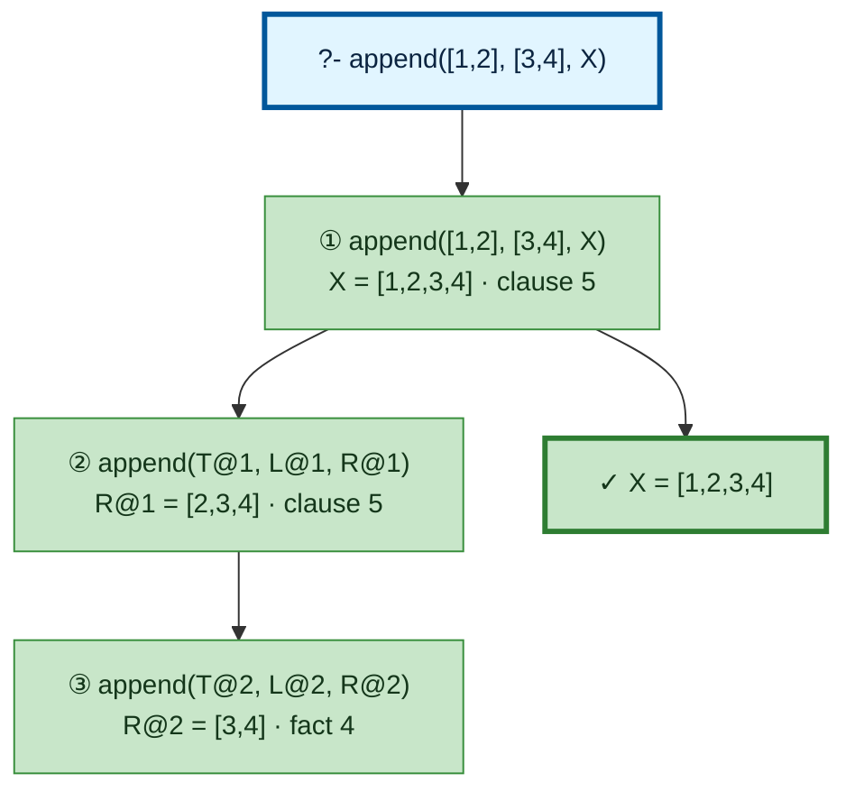

# Prolog Execution Trace: append([1,2], [3,4], X)

## Query

```
append([1,2], [3,4], X)
```

## Clause Definitions

| Line # | Clause |
|--------|--------|
| 4 | `append([], L, L)` |
| 5 | `append([H|T], L, [H|R]) :- append(T, L, R)` |

## Execution Timeline

<pre style="line-height: 1.15">
┌─ Step 1: append([1,2], [3,4], X)
│  Clause: append([H@1|T@1], L@1, [H@1|R@1]) [line 5]
│  Unifications:
│    H@1 = 1
│    T@1 = [2]
│    L@1 = [3,4]
│  Subgoals:
│    [1.1] append(T@1, L@1, R@1) → append([2], [3,4], R@1)
│  
│  ┌─ Step 2 [Goal 1.1]: append(T@1, L@1, R@1) → append([2], [3,4], R@1)
│  │  Clause: append([H@2|T@2], L@2, [H@2|R@2]) [line 5]
│  │  Unifications:
│  │    H@2 = 2
│  │    T@2 = []
│  │    L@2 = [3,4]
│  │  Subgoals:
│  │    [2.1] append(T@2, L@2, R@2) → append([], [3,4], R@2)
│  │  
│  │  ┌─ Step 3 [Goal 2.1]: append(T@2, L@2, R@2) → append([], [3,4], R@2)
│  │  │  Fact: append([], L@3, L@3) [line 4]
│  │  │  Unifications:
│  │  │    L@3 = [3,4]
│  │  │  =&gt; R@2 = [3,4]
│  │  └─
│  │  =&gt; R@1 = [2,3,4]
│  └─
│  =&gt; X = [1,2,3,4]
└─

</pre>

## Call Tree



## Final Answer

```
X = [1,2,3,4]
```

_Showing the first solution only — re-run with `-n <count>` or `--all` to see more._