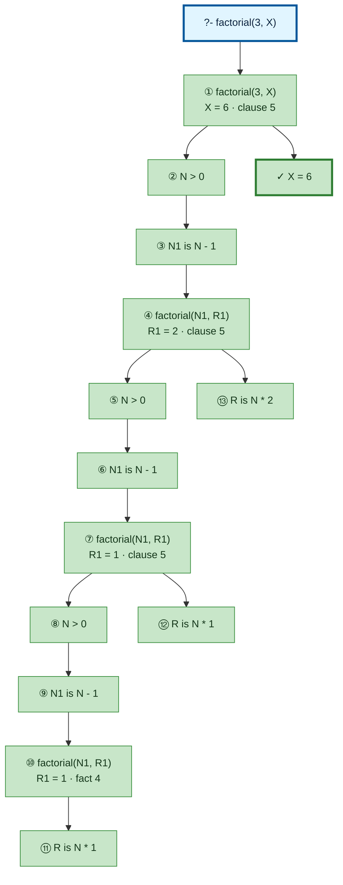

# Prolog Execution Trace: factorial(3, X)

## Query

```
factorial(3, X)
```

## Clause Definitions

| Line # | Clause |
|--------|--------|
| 4 | `factorial(0, 1)` |
| 5 | `factorial(N, R) :- N > 0, N1 is N - 1, factorial(N1, R1), R is N * R1` |

## Execution Timeline

<pre style="line-height: 1.15">
┌─ Step 1: factorial(3, X)
│  Clause: factorial(N, R) [line 5]
│  Unifications:
│    N = 3
│  Subgoals:
│    [1.1] N &gt; 0 → 3 &gt; 0
│    [1.2] N1 is N - 1 → N1 is 3 - 1
│    [1.3] factorial(N1, R1)
│    [1.4] R is N * R1 → R is 3 * R1
│  
│  ┌─ Step 2 [Goal 1.1]: N &gt; 0 → 3 &gt; 0
│  └─
│  ┌─ Step 3 [Goal 1.2]: N1 is N - 1 → N1 is 3 - 1
│  │  =&gt; N1 = 2
│  └─
│  ┌─ Step 4 [Goal 1.3]: factorial(2, R1)
│  │  Clause: factorial(N, R) [line 5]
│  │  Unifications:
│  │    N = 2
│  │  Subgoals:
│  │    [4.1] N &gt; 0 → 2 &gt; 0
│  │    [4.2] N1 is N - 1 → N1 is 2 - 1
│  │    [4.3] factorial(N1, R1)
│  │    [4.4] R is N * R1 → R is 2 * R1
│  │  
│  │  ┌─ Step 5 [Goal 4.1]: N &gt; 0 → 2 &gt; 0
│  │  └─
│  │  ┌─ Step 6 [Goal 4.2]: N1 is N - 1 → N1 is 2 - 1
│  │  │  =&gt; N1 = 1
│  │  └─
│  │  ┌─ Step 7 [Goal 4.3]: factorial(1, R1)
│  │  │  Clause: factorial(N, R) [line 5]
│  │  │  Unifications:
│  │  │    N = 1
│  │  │  Subgoals:
│  │  │    [7.1] N &gt; 0 → 1 &gt; 0
│  │  │    [7.2] N1 is N - 1 → N1 is 1 - 1
│  │  │    [7.3] factorial(N1, R1)
│  │  │    [7.4] R is N * R1 → R is 1 * R1
│  │  │  
│  │  │  ┌─ Step 8 [Goal 7.1]: N &gt; 0 → 1 &gt; 0
│  │  │  └─
│  │  │  ┌─ Step 9 [Goal 7.2]: N1 is N - 1 → N1 is 1 - 1
│  │  │  │  =&gt; N1 = 0
│  │  │  └─
│  │  │  ┌─ Step 10 [Goal 7.3]: factorial(0, R1)
│  │  │  │  Fact: factorial(0, 1) [line 4]
│  │  │  │  =&gt; R1 = 1
│  │  │  └─
│  │  │  ┌─ Step 11 [Goal 7.4]: R is N * R1 → R is 1 * 1
│  │  │  │  where R1 = 1 (from Step 10)
│  │  │  │  =&gt; R = 1
│  │  │  └─
│  │  │  =&gt; R1 = 1
│  │  └─
│  │  ┌─ Step 12 [Goal 4.4]: R is N * R1 → R is 2 * 1
│  │  │  where R1 = 1 (from Step 7)
│  │  │  =&gt; R = 2
│  │  └─
│  │  =&gt; R1 = 2
│  └─
│  ┌─ Step 13 [Goal 1.4]: R is N * R1 → R is 3 * 2
│  │  where R1 = 2 (from Step 4)
│  │  =&gt; R = 6
│  └─
│  =&gt; X = 6
└─

</pre>

## Call Tree



## Final Answer

```
X = 6
```

_Showing the first solution only — re-run with `-n <count>` or `--all` to see more._